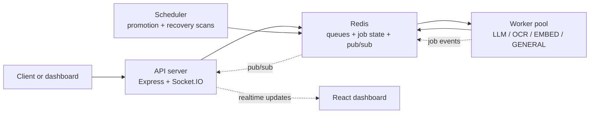
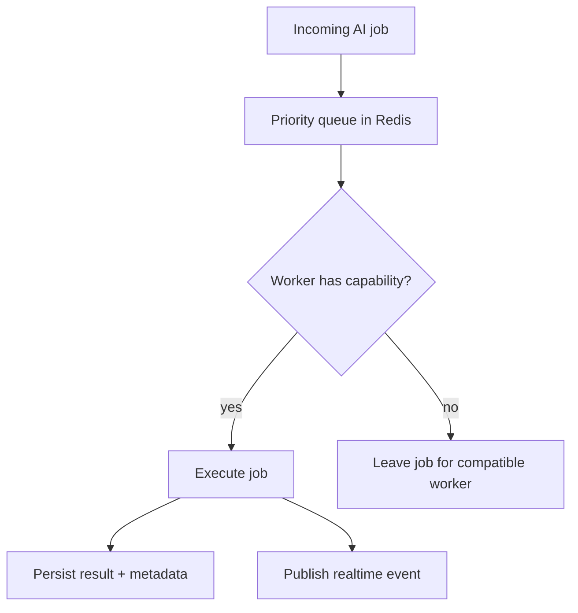
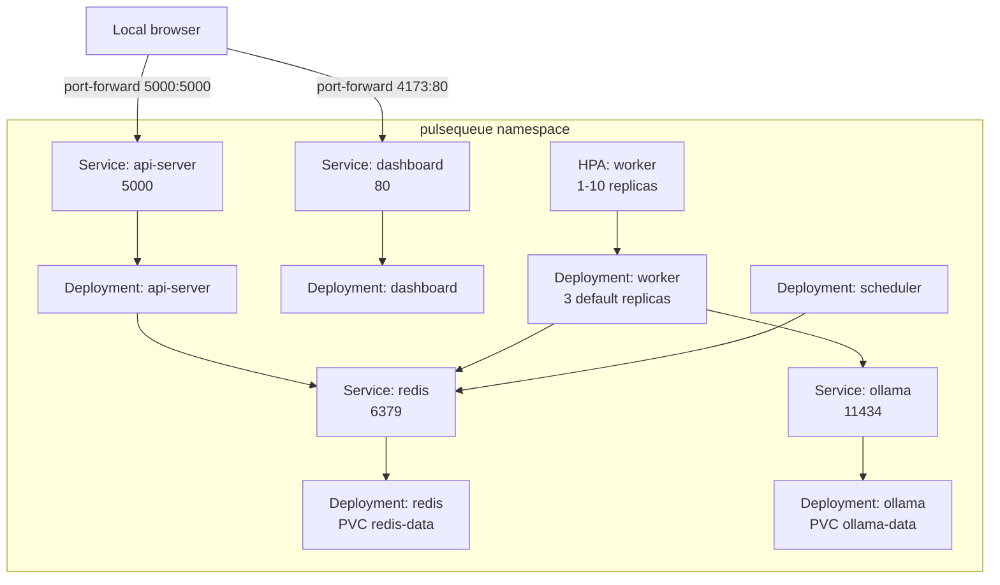

# PulseQueue

> Distributed AI execution infrastructure built from first principles.

PulseQueue is a Redis-backed, cloud-native execution platform for running AI jobs across specialized workers. It combines queueing, worker heartbeats, retry recovery, local model execution, and a realtime observability dashboard.

Inspired by BullMQ, Celery, Sidekiq, Temporal, Ray, Modal, and RunPod.

---

## What It Does

| Capability | Detail |
|---|---|
| Distributed AI workers | Horizontally scalable worker processes that claim jobs from Redis |
| Capability-based routing | Workers only claim jobs they can execute |
| Priority queues | `HIGH`, `MEDIUM`, and `LOW` queues are drained in priority order |
| Local LLM execution | Ollama-backed summarization, translation, and classification |
| OCR execution | OCR jobs are routed to OCR-capable workers |
| Embedding generation | Embedding jobs are routed to embedding-capable workers |
| Retry and recovery | Failed jobs use exponential backoff; orphaned jobs can be recovered |
| Realtime observability | Socket.IO streams job and worker events to the React dashboard |
| Containerized runtime | Docker Compose for local full-stack runs; Kubernetes for local cluster deployment |

---

## AI Job Types

| Job type | Typical runtime | Compatible worker |
|---|---|---|
| `SUMMARIZE` | Ollama local LLM | `LLM` or `GENERAL` |
| `TRANSLATE` | Ollama local LLM | `LLM` or `GENERAL` |
| `CLASSIFY` | Local inference | `LLM` or `GENERAL` |
| `OCR` | OCR executor | `OCR` or `GENERAL` |
| `EMBED` | Embedding executor | `EMBED` or `GENERAL` |

Worker types:

| Worker type | Capability |
|---|---|
| `LLM` | `SUMMARIZE`, `TRANSLATE`, `CLASSIFY` |
| `OCR` | `OCR` |
| `EMBED` | `EMBED` |
| `GENERAL` | All current capabilities |

---

## Architecture



Worker routing:



---

## Stack

| Layer | Technology |
|---|---|
| Frontend | React, Vite, MUI, Recharts, Zustand, Socket.IO Client |
| Backend | Node.js, Express, Socket.IO |
| Queue and coordination | Redis, ioredis |
| AI runtime | Ollama, local AI executors |
| Containers | Docker, Docker Compose |
| Orchestration | Kubernetes, Kustomize, HorizontalPodAutoscaler |

All application packages are JavaScript ESM modules. There is no TypeScript in this repo.

---

## Monorepo Structure

```text
pulsequeue/
|-- services/
|   |-- api-server/
|   |-- worker/
|   |-- scheduler/
|   `-- dashboard/
|       `-- pulsequeue/
|
|-- packages/
|   |-- ai-core/
|   |-- queue-core/
|   |-- redis-client/
|   `-- shared/
|
|-- k8s/
|-- docs/
|-- docker-compose.yml
|-- Dockerfile.api
|-- Dockerfile.worker
|-- Dockerfile.scheduler
|-- Dockerfile.dashboard
`-- CONTEXT.md
```

---

## Docker Compose

Docker Compose is the fastest way to run the full stack on one machine.

```bash
docker compose up --build
```

Open:

- Dashboard: `http://localhost:4173`
- API health: `http://localhost:5000/healthz`
- Redis: `localhost:6379`

Scale workers locally:

```bash
docker compose up --build --scale worker=5
```

Compose runs:

| Service | Build or image | Exposed port |
|---|---|---|
| `redis` | `redis:7-alpine` | `6379` |
| `api-server` | `Dockerfile.api` | `5000` |
| `worker` | `Dockerfile.worker` | internal only |
| `scheduler` | `Dockerfile.scheduler` | internal only |
| `dashboard` | `Dockerfile.dashboard` | `4173 -> 80` |

Compose points workers at:

```text
REDIS_URL=redis://redis:6379
OLLAMA_HOST=http://host.docker.internal:11434
WORKER_TYPE=GENERAL
```

For Ollama-backed jobs in Compose, run Ollama on the host and pull the local model:

```bash
ollama pull qwen2.5:3b
```

---

## Kubernetes

The Kubernetes setup lives in `k8s/` and is applied with Kustomize. It is intended for local Kind or Minikube development.



Build local images from the repository root:

```bash
docker build -f Dockerfile.api -t pulsequeue-api:local .
docker build -f Dockerfile.worker -t pulsequeue-worker:local .
docker build -f Dockerfile.scheduler -t pulsequeue-scheduler:local .
docker build -f Dockerfile.dashboard -t pulsequeue-dashboard:local .
```

Load images into Kind:

```bash
kind load docker-image pulsequeue-api:local
kind load docker-image pulsequeue-worker:local
kind load docker-image pulsequeue-scheduler:local
kind load docker-image pulsequeue-dashboard:local
```

For Minikube on Windows PowerShell, build inside Minikube's Docker daemon:

```powershell
minikube docker-env | Invoke-Expression
docker build -f Dockerfile.api -t pulsequeue-api:local .
docker build -f Dockerfile.worker -t pulsequeue-worker:local .
docker build -f Dockerfile.scheduler -t pulsequeue-scheduler:local .
docker build -f Dockerfile.dashboard -t pulsequeue-dashboard:local .
```

Create the optional OpenAI secret if you plan to run OpenAI-backed jobs:

```bash
kubectl create namespace pulsequeue
kubectl create secret generic pulsequeue-secrets \
  --namespace pulsequeue \
  --from-literal=OPENAI_API_KEY='your-key-here'
```

Deploy:

```bash
kubectl apply -k k8s
kubectl get pods -n pulsequeue
kubectl get svc -n pulsequeue
kubectl get hpa -n pulsequeue
```

Expose locally:

```bash
kubectl port-forward -n pulsequeue svc/dashboard 4173:80
kubectl port-forward -n pulsequeue svc/api-server 5000:5000
```

Manual worker scaling:

```bash
kubectl scale deployment/worker -n pulsequeue --replicas=5
```

The worker HPA scales from 1 to 10 replicas at 70% CPU utilization. It requires Metrics Server. On Minikube:

```bash
minikube addons enable metrics-server
```

More Kubernetes detail is in `docs/kubernetes.md`.

---

## API Example

Create an AI execution job:

```http
POST /jobs
Content-Type: application/json

{
  "type": "SUMMARIZE",
  "payload": {
    "text": "Redis is an in-memory data structure store used as a database, cache, and message broker."
  },
  "priority": "HIGH"
}
```

Example OCR job:

```json
{
  "type": "OCR",
  "payload": {
    "imageUrl": "https://example.com/document.png"
  },
  "priority": "MEDIUM"
}
```

---

## Redis Data Model

| Redis key | Purpose |
|---|---|
| `jobs:data` | Job metadata and state |
| `queue:waiting:*` | Priority execution queues |
| `queue:delayed` | Scheduled retry and delayed jobs |
| `workers:heartbeats` | Worker liveness tracking |
| `workers:capabilities` | Worker capability registry |
| `queue:completed` | Completed execution audit log |
| `queue:failed` | Failed job inspection |

---

## Engineering Concepts

- Distributed systems
- AI orchestration
- Capability-based scheduling
- Worker specialization
- Queueing theory
- Redis-backed coordination
- Heartbeats and crash recovery
- Exponential backoff retries
- Event-driven architecture
- Realtime observability
- Kubernetes autoscaling

---

## Roadmap

- GPU worker orchestration
- AI execution DAG pipelines
- Vector database integration
- OpenTelemetry tracing
- Prometheus metrics
- Distributed inference batching
- Multi-model scheduling
- AI pipeline execution graphs
